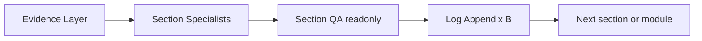

# Fullstack To SRS - Subagent Orchestration Playbook

Read this file **immediately** when the skill is invoked, together with [section-agents.md](section-agents.md) and [output-layout.md](output-layout.md). The parent agent acts as **Orchestrator** by default.

## Orchestrator Responsibilities

The parent agent MUST:

1. Assess project size tier (Trivial / Normal / Large).
2. Plan phase and module execution.
3. Dispatch subagents via the Task tool (parallel when independent).
4. Maintain the **Evidence Ledger** (see section-agents.md) after Phase 1.
5. Run **Write → Validate → Log** for every section in scope.
6. Merge subagent artifacts; patch `[CONFIRMATION REQUIRED]` on QA WARN/FAIL.
7. Log all Section QA results in Appendix B (non-blocking).
8. Re-dispatch **GapFill** only for specific missing Cap-IDs from Sec08_QA.
9. **Persist artifacts** to the resolved docs output path.
10. Run **FinalQA** before marking the SRS complete.

The parent agent MUST NOT (for Normal/Large projects):

- Explore the entire codebase alone instead of dispatching explore subagents.
- Write section files without dispatching the matching Section Specialist.
- Skip Section QA validators or FinalQA.
- Block the pipeline on Section QA FAIL (log and continue per QA policy).
- Deliver SRS in chat without persisting section files to docs output path.

## Project Size Tiers

| Tier | Condition | Strategy |
|------|-----------|----------|
| **Trivial** | <= 1 module AND <= 5 estimated capabilities | Single-agent fast path allowed; may inline QA checklists |
| **Normal** | 2-5 modules OR 6-30 capabilities | Section specialists + Section QA mandatory per phase |
| **Large** | > 5 modules OR > 30 capabilities | Full fan-out for all phases |

When uncertain, assume **Normal** and use section specialists.

## Architecture: Evidence → Specialist → QA

Full role definitions, playbooks, and checklists: [section-agents.md](section-agents.md).

## Phase Fan-Out

### Phase 1 - Skeleton

**Step 1 — Evidence (parallel):**

| Role | subagent_type | thoroughness |
|------|---------------|--------------|
| RepoMapper | `explore` | `very thorough` |
| FE_Scanner | `explore` | `very thorough` |
| BE_Scanner | `explore` | `very thorough` |

Orchestrator merges → Module Map, Evidence Ledger draft, expected UC/US counts per module.

**Step 2 — Writers (parallel):**

| Role | subagent_type | Output file |
|------|---------------|-------------|
| Sec01_Specialist | `generalPurpose` | `01-introduction.md` |
| Sec02_Specialist | `generalPurpose` | `02-overall-description.md` |

Also create root `README.md`; create section README indexes for `03`, `06`, `07`, and `08`; initialize `12-appendix.md` with Appendix B template.

**Step 3 — QA (parallel, readonly):**

| Role | subagent_type | Validates |
|------|---------------|-----------|
| Sec01_QA | `generalPurpose` | `01-introduction.md` |
| Sec02_QA | `generalPurpose` | `02-overall-description.md` |

Log QA results → Appendix B. Patch `[CONFIRMATION REQUIRED]` on WARN/FAIL. Continue.

### Phase 2 - Per Module

Repeat for **one module at a time**. QA FAIL does **not** block the next module; gaps are logged.

**Step 1 — Evidence (parallel):**

| Role | subagent_type | Scope |
|------|---------------|-------|
| FE_Module | `explore` | Client evidence for current module only |
| BE_Module | `explore` | Server evidence for current module only |

Orchestrator merges → module Capability Inventory (all Cap-IDs with UC-ID/US-ID assignments). Update Evidence Ledger.

**Step 2 — Writers (parallel, only after inventory complete):**

| Role | subagent_type | Output file |
|------|---------------|-------------|
| Sec03_Specialist | `generalPurpose` | `03-functional-requirements/module-[module-slug].md` |
| Sec06_Specialist | `generalPurpose` | `06-data-requirements/module-[module-slug].md` |
| Sec07_Specialist | `generalPurpose` | `07-business-rules/module-[module-slug].md` |
| Sec08_Specialist | `generalPurpose` | `08-use-cases-user-stories/module-[module-slug].md` |

**Step 3 — QA (parallel, readonly):**

| Role | subagent_type | Validates |
|------|---------------|-----------|
| Sec03_QA | `generalPurpose` | FR coverage for module |
| Sec06_QA | `generalPurpose` | Data requirements for module |
| Sec07_QA | `generalPurpose` | Business rules for module |
| Sec08_QA | `generalPurpose` | UC/US completeness for module |

Log QA → Appendix B. Optional **GapFill** if Sec08_QA lists missing Cap-IDs only (max 2 retries).

### Phase 3 - Finalization

**Step 1 — Writers (parallel):**

| Role | subagent_type | Output file |
|------|---------------|-------------|
| Sec04_Specialist | `generalPurpose` | `04-non-functional-requirements.md` |
| Sec05_Specialist | `generalPurpose` | `05-external-interface-requirements.md` |
| Sec09_Specialist | `generalPurpose` | `09-error-handling.md` |
| Sec10_Specialist | `generalPurpose` | `10-security-requirements.md` |
| Sec11_Specialist | `generalPurpose` | `11-acceptance-criteria.md` |

**Step 2 — QA (parallel, readonly):** Sec04_QA through Sec11_QA.

**Step 3 — Finalize:**

| Role | subagent_type | Scope |
|------|---------------|-------|
| Sec12_Merger | `generalPurpose` | Finalize `12-appendix.md` |
| Sec12_QA | `generalPurpose` | Validate appendix completeness |
| FinalQA | `generalPurpose` | Cross-section validation + coverage summary |

Orchestrator updates `README.md` status = Complete; reports paths and QA summary to user.

## Write → Validate → Log Loop

For every section written in the current phase:

1. **Write:** dispatch Section Specialist with Evidence Ledger + prior artifacts.
2. **Validate:** dispatch matching Section QA with `readonly: true`.
3. **Log:** append row to Appendix B Section QA Summary.
4. **Patch:** add `[CONFIRMATION REQUIRED]` to affected items in the section file.
5. **Continue:** proceed to next section/module (do not block on FAIL).

## Parallel Dispatch Rules

- Launch independent subagents in **one message** with multiple Task tool calls.
- Do not run Section Specialists before evidence merge for that phase is complete.
- Do not run Section QA before the matching section file is written.
- Pass Evidence Ledger, Module Map, Capability Inventory, and Output path in every prompt.
- Section QA subagents MUST use `readonly: true`.

## Subagent Return Format (mandatory)

Every subagent must return this structure:

## Subagent Deliverable
- Role: [Sec03_Specialist | Sec08_QA | FE_Module | ...]
- Module: [name or all]
- Capabilities found: N
- Use cases written: N (if applicable)
- User stories written: N (if applicable)

## Artifact
[tables, sections, or inventory per role]

## Assumptions
- ...

## Conflicts
- ...

## Open [CONFIRMATION REQUIRED]
- ...

Section Specialists and Section QA also follow formats in [section-agents.md](section-agents.md).

## Merge Protocol

When combining subagent outputs:

1. **Union capabilities** - never drop Cap-IDs from any subagent.
2. **Dedupe by Cap-ID** - if FE and BE disagree, keep both evidence notes; mark conflict `[CONFIRMATION REQUIRED]`.
3. **Canonical terms** - prefer user-visible labels from FE_Module over internal BE names.
4. **Preserve IDs** - do not renumber FR/UC/US/CAP during merge unless resolving duplicates.
5. **Coverage check** - after merge: count(UC) >= count(Cap-ID), count(US) >= count(UC).
6. **No technical leakage** - strip file/class/function names from final SRS text.
7. **QA log union** - append every Section QA report to Appendix B; never discard WARN/FAIL findings.

## Retry Protocol

When Sec08_QA reports missing Cap-IDs:

1. Extract failed Cap-IDs from Sec08_QA report.
2. Dispatch **GapFill** subagent with **only** the gap list - do not rewrite the whole module.
3. Merge gap artifacts into the affected file under `08-use-cases-user-stories/module-[module-slug].md`.
4. Re-run Sec08_QA on the affected module only.
5. Maximum 2 GapFill retries per module; if still failing, log gaps in Appendix B with `[CONFIRMATION REQUIRED]`.

For other Section QA FAIL items: patch `[CONFIRMATION REQUIRED]`, log in Appendix B, continue. FinalQA aggregates.

## Deprecated Roles

Do **not** dispatch these legacy roles (replaced by section specialists):

| Deprecated | Replacement |
|------------|-------------|
| UC_Writer, US_Writer | Sec08_Specialist |
| FR_BR_Writer | Sec03_Specialist, Sec06_Specialist, Sec07_Specialist |
| CrossCutting | Sec04_Specialist, Sec09_Specialist, Sec10_Specialist |
| QA_Coverage | Sec08_QA + FinalQA |
| Merger | Sec12_Merger |

## Orchestration Anti-Patterns

| Anti-Pattern | Correct Action |
|--------------|----------------|
| Parent reads 50+ files alone on Normal/Large project | Dispatch FE_Module + BE_Module |
| Single generalPurpose agent writes all 12 sections | Dispatch SecNN_Specialist per section |
| Skip Section QA to save time | Always run matching SecNN_QA readonly |
| Block pipeline on Section QA FAIL | Log, patch CONFIRMATION REQUIRED, continue |
| Restart entire Phase 2 on minor gap | GapFill for missing Cap-IDs only |
| Merge without Evidence Ledger | Build ledger in Phase 1; pass to all agents |

---

## Prompt Templates

Copy and adapt. Replace bracket placeholders. See [section-agents.md](section-agents.md) for full SecNN templates.

### RepoMapper

You are RepoMapper subagent for fullstack-to-srs.
Repository: [path]
Output path: [resolved docs path]
Task: Map repository structure and business module boundaries.
Deliver Module Map, module codes, estimated capability count per module.
Use subagent return format from orchestration.md. thoroughness: very thorough

### FE_Scanner

You are FE_Scanner subagent for fullstack-to-srs.
Repository: [path]
Scope: All client-side evidence (routes, screens, navigation, forms, actions, messages).
Deliver FE capability seed table with confidence tiers for Evidence Ledger.
Use subagent return format from orchestration.md. thoroughness: very thorough

### BE_Scanner

You are BE_Scanner subagent for fullstack-to-srs.
Repository: [path]
Scope: All server entry points (API, RPC, events, jobs, workflows).
Deliver BE capability seed table with confidence tiers for Evidence Ledger.
Use subagent return format from orchestration.md. thoroughness: very thorough

### FE_Module

You are FE_Module subagent for fullstack-to-srs.
Repository: [path], Module: [ModuleName], code: [MODCODE]
Scope: Client evidence for this module ONLY.
Deliver complete FE capability list, user-visible terms, flows, validations, permission behavior.
Use subagent return format from orchestration.md.

### BE_Module

You are BE_Module subagent for fullstack-to-srs.
Repository: [path], Module: [ModuleName], code: [MODCODE]
Scope: Server evidence for this module ONLY.
Deliver complete BE capability list, business rules, validations, states, authorization outcomes.
Use subagent return format from orchestration.md.

### GapFill

You are GapFill subagent for fullstack-to-srs.
Module: [ModuleName]. Gap list ONLY: missing Cap-IDs from Sec08_QA report.
Fill ONLY gaps in the affected Section 8 module file. Match existing ID scheme and terminology.
Use subagent return format from orchestration.md.

### SecNN_Specialist / SecNN_QA / Sec08_Specialist / Sec12_Merger / FinalQA

Use prompt templates in [section-agents.md](section-agents.md).
